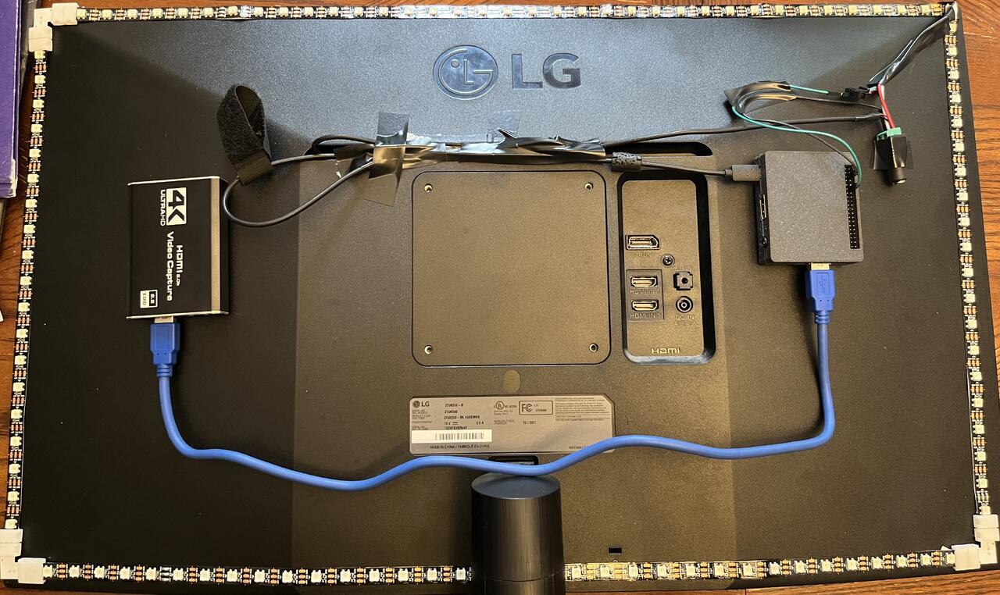
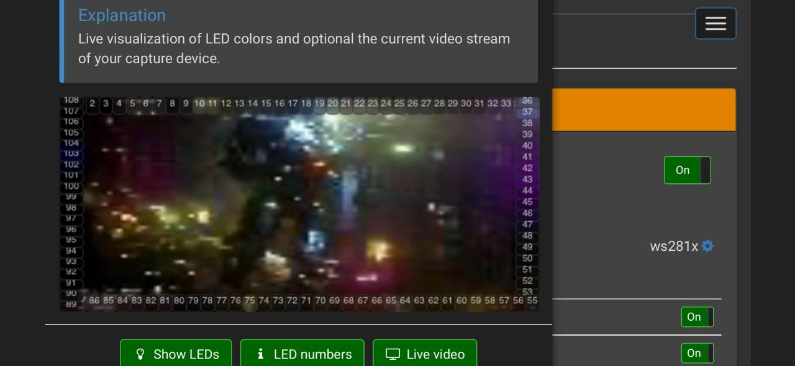
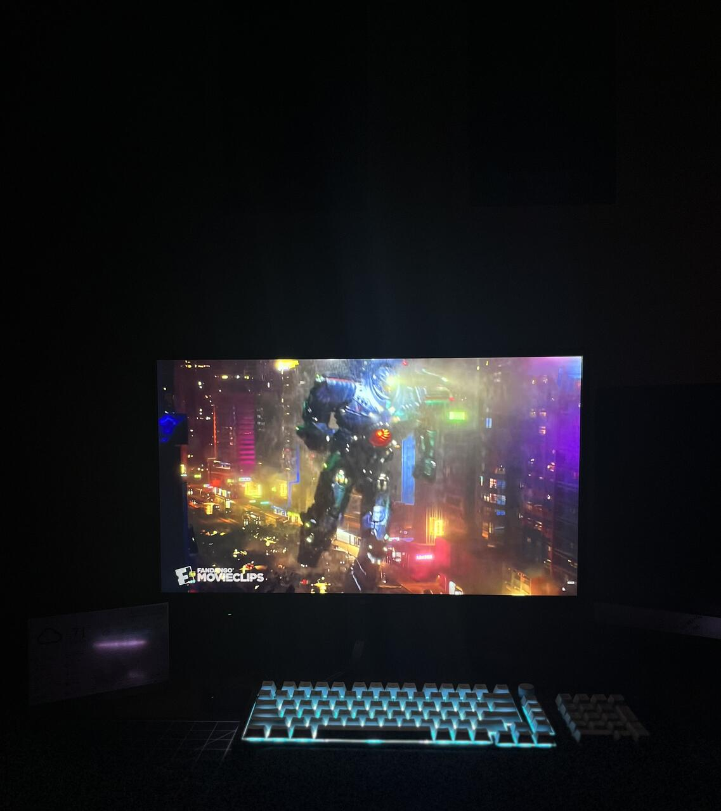
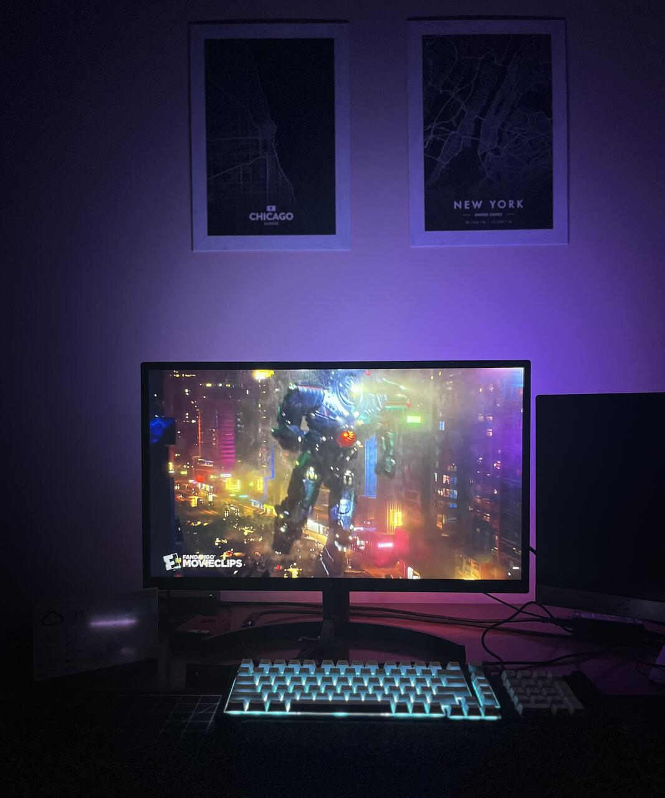
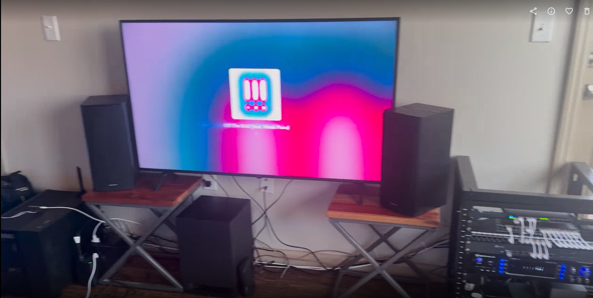

# Ambient TV Lighting Version 2

## Project Background
Tested out ambient lighting on PC monitor in early 2020 as a proof of concept.  The idea of how this works is listed below.

 - Inject an HDMI signal from my source into a 4k capture card
 
 - The capture card would output the signal to the monitor and the raspberry pi

 - The raspberry pi would process the image and output LED color data and intensity to a LED strip on the perimeter of the back of the monitor.

 - The capture card would ouput another output to the monitor so I can watch

Pictures of version 1 setup listed below with annotations explaining the concept

*
Back of Monitor Setup: 4K Capture card left, USB to RP4 middle, RP4 Right
*

*
RP4 Hyperion Setup with digital LED number to Physical in 1st image
*

*
Monitor without Hyperion Ambient Lighting
*

*
Monitor with Hyperion Ambient Lighting
*

## Version 2 Project

### Goals

I learned alot when doing version 1 on how to make this work. I have goals I would like to accomplish on Version 2 listed below.

- Make it look clean and professional, `NO LOOSE WIRES`
  - Utilize cable organizers, wire looms, ect...
  - Take advantage of VESA mounting holes on back of TV
  - Make lighting diffuesed
- Should be able to be placed and removed with minimal work.
- Integrate with HomeAssistant to auto turn on and off under environmental variables
  - Ambient lighting should turn on when Nvidia Shield is turned on
    - Reason: waste of power for nothing
    - How: HomeAssistant Automation
  - Ambient lighting should turn on when it is dark in the viewing environment
    - Reason: not purposeful if the room is blown out with light
    - How: create esp32 lumen sensor to drive ambient lighting

### Setup

*
Version 2 Apartment TV Setup
*