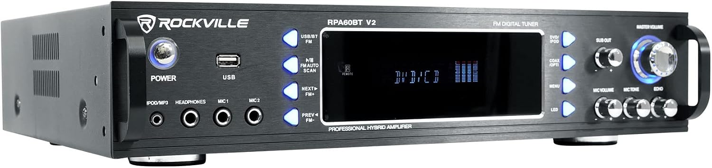

# 1. SolidWorks Table of Contenets

- [1. SolidWorks Table of Contenets](#1-solidworks-table-of-contenets)
  - [1.1. RPA60BT V2 Rackmount Brackets](#11-rpa60bt-v2-rackmount-brackets)
    - [1.1.1. Drawings](#111-drawings)
    - [1.1.2. Pictures](#112-pictures)
    - [1.1.3. 3D Files](#113-3d-files)
    - [1.1.4. STL Files](#114-stl-files)
  - [1.2. 1U Rackmount Bracket](#12-1u-rackmount-bracket)

## 1.1. RPA60BT V2 Rackmount Brackets

Folder containing designs for the Rockville RPA60BT V2 sound system amp.  The brackets mount to the side of the stereo amp to allow for server rack mounting.

 

## 1.2. 1U Rackmount Bracket

Working on a 1U bracket for server rack, idea is to test out different designs to consolidate my server rack.