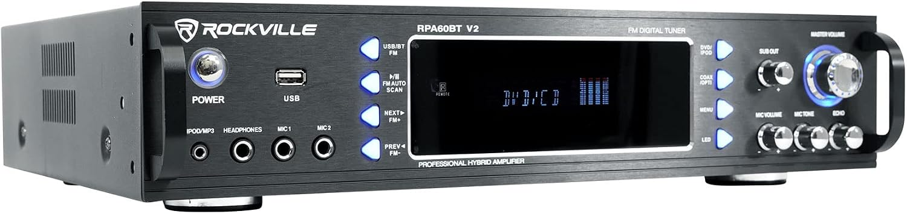

# 1. SolidWorks Table of Contenets

- [1. SolidWorks Table of Contenets](#1-solidworks-table-of-contenets)
  - [1.1. RPA60BT V2 Rackmount Brackets ``COMPLETE``](#11-rpa60bt-v2-rackmount-brackets-complete)
  - [1.2. 1U Rackmount Bracket ``IN-PROGRESS``](#12-1u-rackmount-bracket-in-progress)
  - [1.3. ESP32 Cases ``IN-PROGRESS``](#13-esp32-cases-in-progress)
  - [1.4. Ambient Lighting V2 ``IN-PROGRESS``](#14-ambient-lighting-v2-in-progress)

## 1.1. RPA60BT V2 Rackmount Brackets ``COMPLETE``

Folder containing designs for the Rockville RPA60BT V2 sound system amp.  The brackets mount to the side of the stereo amp to allow for server rack mounting.

 

## 1.2. 1U Rackmount Bracket ``IN-PROGRESS``

Working on a 1U bracket for server rack, idea is to test out different designs to consolidate my server rack.

## 1.3. ESP32 Cases ``IN-PROGRESS``

Working on cases for ESP32

## 1.4. Ambient Lighting V2 ``IN-PROGRESS``

Working on redoing ambient lighting for my TV but better.